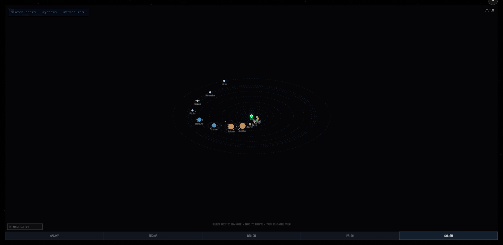

# derived-world-class — the live check

⛔ **IN-REPO ON PURPOSE.** Live artifacts do not live in `/tmp`.

Driven in the running game at `http://localhost:5175/well-dipper/`, **hard-reloaded with cache ignored
before every measurement** — a page hot-reloaded through a build is not evidence about shipped code,
and this dev-server process had been up since before any of these edits. The server's own cwd was
checked (`/proc/<pid>/cwd` → `/home/ax/projects/well-dipper`) so it is THIS lane, not a sibling
worktree serving pre-merge code.

**Liveness probe, before any measurement.** Gas bodies come back with `worldClass: null` and solid ones
with a string, on a page that never had the field — so the browser is running the new module, not a
cached one.

## AC-4 — the info panel ✅ PASS

`?system=rocky-126`, the same seed the volatile-delivery workstream used, selected through the game's
own selection path (`_lab.selectBody('planet', i)`), text read off `#body-info` after waiting for the
typewriter to settle rather than on a fixed sleep.

| planet | formation roll | derived | what the panel SAYS |
|---|---|---|---|
| 1 | `ice` | `terrestrial` | **PVX J3DK6GAO+RBJGI5M C — TERRESTRIAL** · 1.1 R⊕ · Clouds · Atmosphere |
| 0 | `rocky` | `venus` | PVX J3DK6GAO+RBJGI5M B — **VENUSIAN** · 0.5 R⊕ · Atmosphere |
| 2 | `carbon` | `ice` | PAUROSGARA — **ICE WORLD** · 0.7 R⊕ · Atmosphere |

⭐ **Planet 1 is the exact world Max UAT'd on 2026-09-04 with "yep, it works"** — 1.08 R⊕, 293 K,
volatiles 0.310. The game called it an **Ice World** before this change and calls it **TERRESTRIAL**
now.

## AC-6 — the seed search ✅ PASS

Clicked the real `Habitable Planet` button in the FIND NEAREST panel (`data-find="habitable"`), not a
function call. It searched, warped, and spawned `VLC J3DG0MO8+HZDHN9R`.

The world it handed back: formation roll `terrestrial`, derived `terrestrial`, **surface 268 K,
volatiles 0.235, 0.90 R⊕** — `passesWarmWetGates: true`. Before this change the filter read the
formation roll, which returned systems whose only `ocean` was hot and dry (7 of 7, median 355 K) and
missed 11 of the 14 real ones.

## AC-5 — the orrery dots ⚠️ NOT CLOSED, and the reason is not this change

The colour lookup is wired and verified three ways — the draw site reads
`planetColors[displayClassOf(pd)]` (all three colour reads in `NavComputer`), `displayClassOf` returns
the derived class when called in-page on live planet records, and instrumenting `ctx.arc`/`ctx.fill`
for ~300 frames shows the orrery filling planet discs with values straight out of that table
(`#a09080` rocky, `#c0a050` venus, `#b0c8e0` ice).

**What could not be shown is a KNOWN habitable world drawn green, because the orrery's planet list does
not match the scene's.**

| | scene (`_lab.systemInfo()` + `_systemData`) | orrery, per instrumented frame |
|---|---|---|
| first look | `rocky-126`, 6 planets | **Sol** — Earth, Mars, Jupiter, Saturn, Pluto, Eris… |

| | | |
|---|---|---|
| after the habitable search | `VLC J3DG0MO8+HZDHN9R` — carbon, terrestrial, rocky, sub-neptune | 4 discs: rocky, rocky, venus, ice |

⛔ **This is a divergence about WHICH SYSTEM the orrery draws, which nothing in this workstream
touches.** It was already there on the first look, where the scene was `rocky-126` and the orrery drew
Sol. The likely mechanism is that the orrery regenerates from the galactic star rather than reading the
spawned scene (and a regeneration without the same galaxy context yields different planet types), but
that was NOT established and should not be repeated as fact.

⚠ It matters for the goal: "spot a habitable world on the map before you fly to it" cannot be trusted
while the map may be describing a different system than the one you are in. **Own session.** Nothing
here should be read as evidence the orrery is fine.

## Browser hygiene

No new tabs were opened — the existing page was reused, and the nav computer and debug panel were
closed again afterwards.
