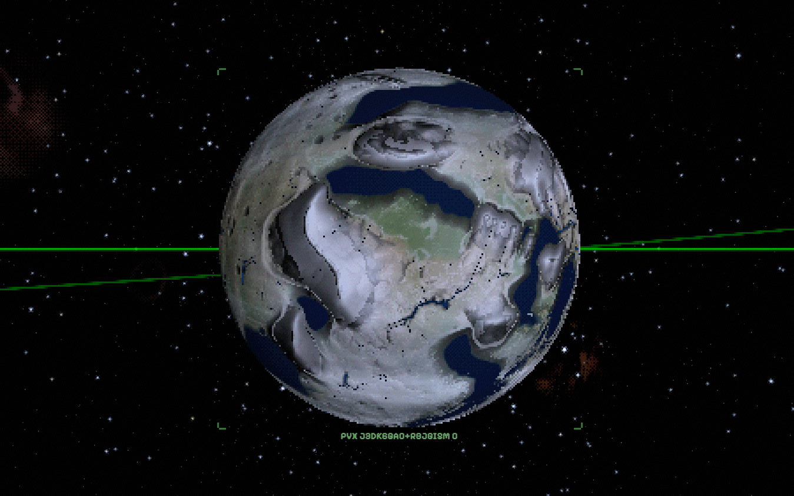
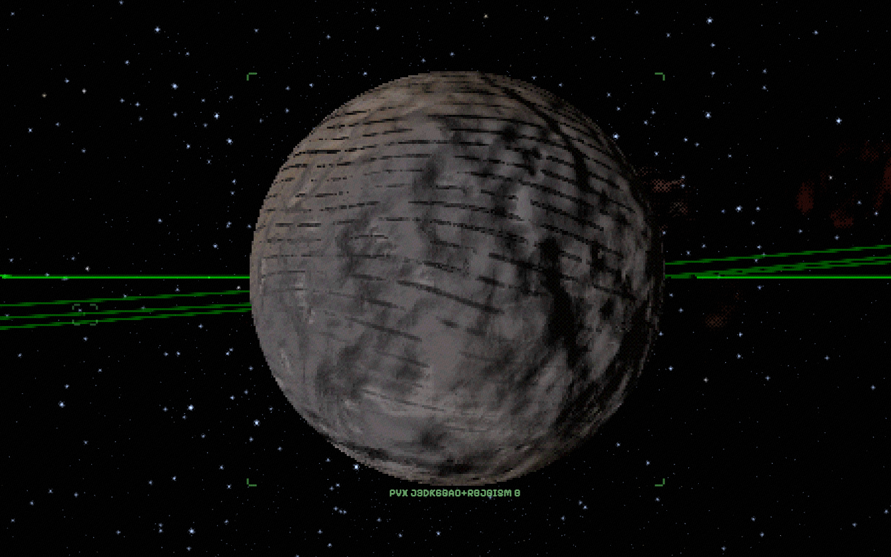

# volatile-delivery — the live check (AC-7)

⛔ **IN-REPO ON PURPOSE.** Live-pair artifacts do not live in `/tmp`.

Driven in the running game at `http://localhost:5175/well-dipper/?system=rocky-126`, **hard-reloaded
first** — a page hot-reloaded through a build is not evidence about shipped code, and the dev-server
process serving this tree had been up since 2026-09-01, i.e. since before any of these edits.

**Liveness probe, before any measurement.** `StarSystemGenerator.generate('rocky-126')` was run inside
the page and its bodies carry `composition.iceFraction`, the field that did not exist at the parent.
So the browser is executing the new code, not a cached module.

## The body

`rocky-126`, the **second** planet — `body.planet.e8f330`, displayed as **"PVX J3DK6GAO+RBJGI5M c"**.

| | |
|---|---|
| radius | 1.078 R⊕ |
| mass | 1.19 M⊕ |
| T_eq | 293 K (20 °C) |
| volatiles, parent → HEAD | **0.0244 → 0.3095** |
| dispatch | step 6, IN BAND → modal `mobile` → **`plate()`** |

⭐ It is an Earth analogue, and it is the first body in this galaxy to reach the plate path. At the
parent its volatiles sat at 0.0244 — under `labCore.js:693`'s bone-dry floor of 0.05 — so every
water-driven uniform below read 0 or −1.

## Read off the LIVE material, after the worker bake landed

| uniform | parent | HEAD (live) |
|---|---:|---:|
| `uSeaLevel` | −1 (no sea) | **0.0982** (a solved sea) |
| `uLiquidMask` | 0 | **0.6191** |
| `uCoastStrength` | 0 | **1** |
| `uDeltaDensity` | 0 | **1** |
| `uStrandStrength` | 0 | **1** |
| `uKarstDensity` | 0.4 | **1** |
| `uDuneDensity` | 1 | 0.35 (a wet world stops being a dune world) |

The live `uLiquidMask` 0.6190885971565789 is **bit-for-bit** the headless prediction, so the game and
the offline population read agree on the same body. `uSeaLevel` differs from the headless 0.1095
because the router SOLVES it against the histogram during the bake — that is the sea level being
computed, not a disagreement.

## [CONTROL] — the dry world one planet in

`body.planet.0ef5aa`, **"PVX J3DK6GAO+RBJGI5M b"**, 0.513 R⊕, volatiles 0.02 (the trace floor):
`uSeaLevel −1 · uLiquidMask 0 · uCoastStrength 0 · uDuneDensity 1`. Unchanged from the parent, and it
renders as a grey dune-streaked desert. **Same system, same law, opposite outcome** — which is the
control that shows the change is not a blanket wetting.

| | |
|---|---|
|  |  |
| the second planet — seas, coasts, green lowlands | the first planet — desert, unchanged |

⚠ **`freezeFrame()` timed out** on this page (the call blocks and the CDP evaluate hit its protocol
timeout), so these two are single frames rather than an ON/OFF pixel pair. That is sound for what they
are asked to show — presence of ocean vs its absence, on two different bodies at one instant — and the
numeric arm above is the objective evidence. A rotation-sensitive pixel-delta pair would need the
freeze to work; noted rather than claimed.

⚠ **Not this workstream's, but seen here and worth logging:** the wet Earth analogue carries the
legacy game type string `type: 'ice'`, because `PlanetGenerator._pickType` picks from ORBIT, not from
composition. A 293 K ocean world labelled `ice` is a pre-existing mislabel (the world engine reads
`compositionClass` and correctly answers `rocky`), unchanged by this workstream.
